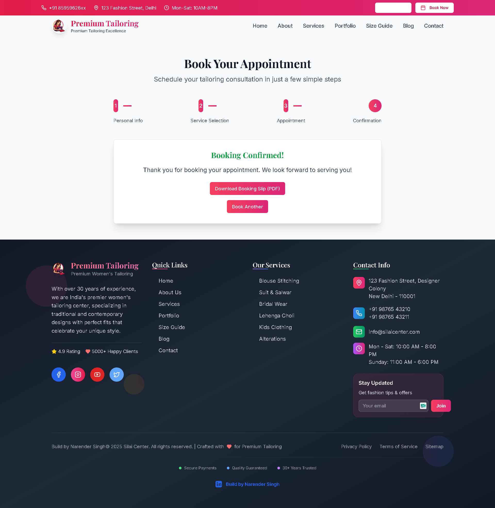
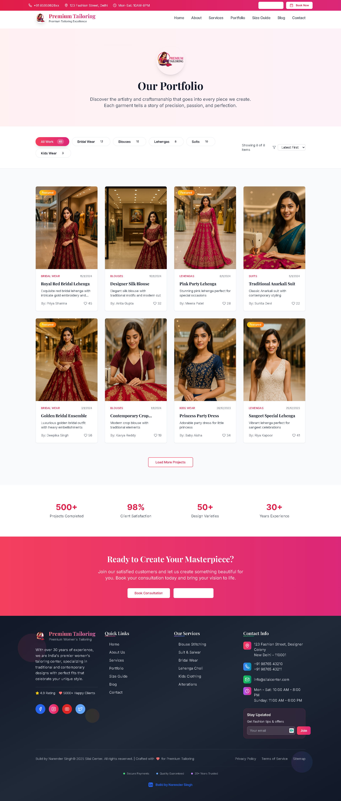
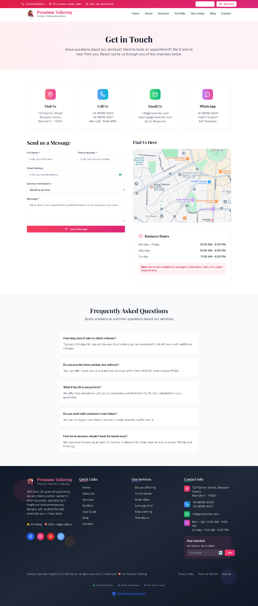
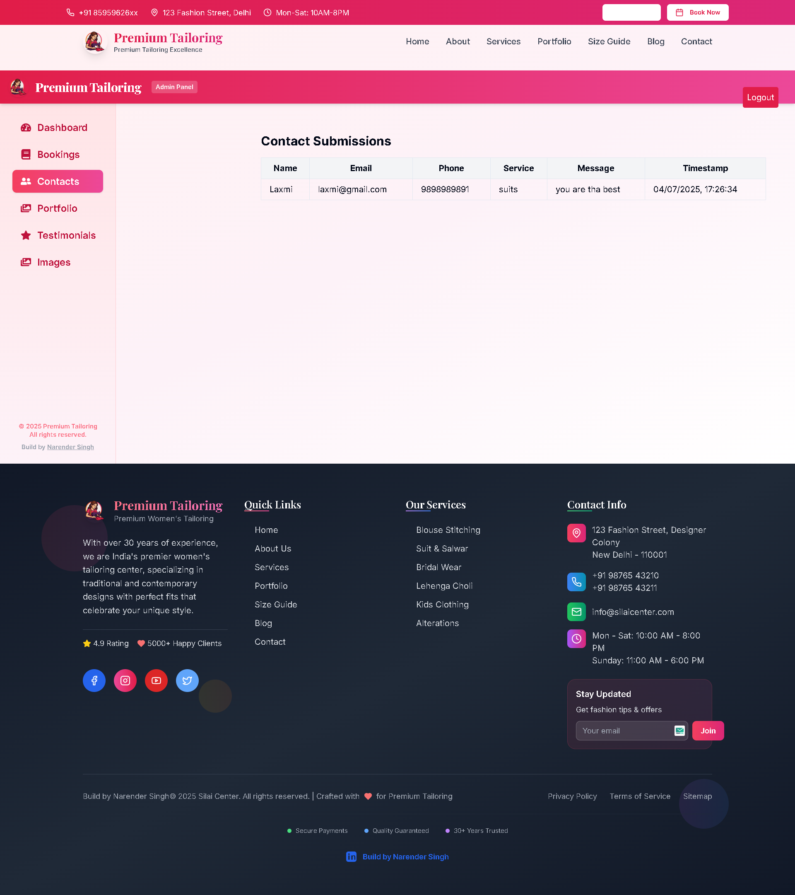
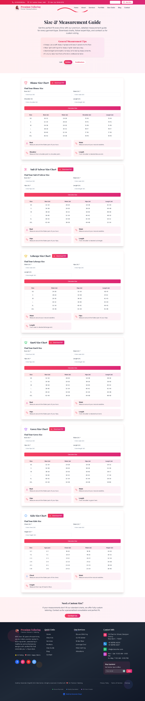
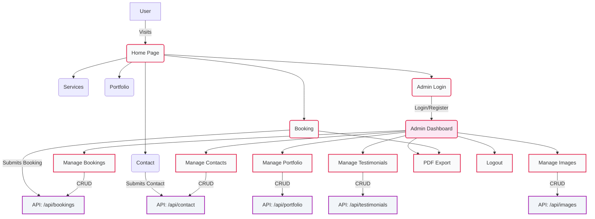

<p align="center">
  
</p>

<h1 align="center">✨ VastraCraft ✨</h1>

<p align="center">
  
</p>

---

<p align="center">
  
  
  
  
  
  
  
  
  
</p>

---

<div align="center">

| 📚 **Table of Contents** |
|:------------------------:|

| [🚀 Live Demo](#-live-demo) | [🎥 Demo Video](#-demo-video) | [💎 Why Choose This Product?](#-why-choose-this-product) |
|--------------------------|-------------------------------|-----------------------------------------------|
| [💼 Business Value](#-business-value) | [🧩 Animated Feature Grid](#-animated-feature-grid) | [🖼️ Screenshots](#-screenshots) |
| [👥 User Stories](#-user-stories) | [🌟 Social Proof](#-social-proof) | [🛠️ How it Works](#-how-it-works) |
| [🛠️ Tech Stack](#-tech-stack) | [🏗️ Project Structure](#-project-structure) | [🗺️ Architecture Diagram](#-architecture-diagram) |
| [🛡️ Admin Dashboard](#-admin-dashboard) | [📄 PDF Export](#-pdf-export) | [📞 Contact & WhatsApp](#-contact--whatsapp) |
| [📱 Mobile Experience](#-mobile-experience) | [⚡ Performance](#-performance) | [🔒 Security](#-security) |
| [⚡ Setup & Deployment](#-setup--deployment) | [❓ FAQ](#-faq) | [🗺️ Roadmap](#-roadmap) |
| [📝 Changelog](#-changelog) | [🤝 Contributing](#-contributing) | [🔑 License & Usage](#-license--usage) |
| [🙏 Credits](#-credits) | [👨‍💻 Team](#-team) | [🚀 Push to GitHub](#-push-to-github) |
| [💬 Contact & Support](#-contact--support) | [🙏 Thanks](#-thanks) | [⚖️ Legal Notice](#-legal-notice) |

</div>

---

## 🚀 Live Demo

> https://premium-tailoring-website.vercel.app

---

## 🎥 Demo Video

> _Add your product demo video here!_

---

## 💎 Why Choose This Product?

- **Built for real tailoring businesses**: Not just a template, but a full product for Indian and global studios.
- **Premium, creative, and modern UI**: Impress your clients and stand out from the crowd.
- **Admin dashboard for live management**: Bookings, contacts, portfolio, testimonials, images—all in one place.
- **PDF export for bookings and size guides**: Professional, branded documents for your clients.
- **Mobile-first, lightning-fast, and SEO-optimized**: Works and ranks everywhere.
- **No code bloat, only real features.**

---

## 💼 Business Value

- 🚀 **Boosts client trust** with testimonials, portfolio, and professional branding
- 💸 **Increases bookings** with a seamless, multi-step booking flow
- 📈 **Grows your business** with live admin management and analytics
- 🏆 **Saves time** with PDF exports, automated emails, and easy data management
- 🔒 **Keeps your data secure** with JWT auth and protected admin routes

---

## 🧩 Animated Feature Grid

| 🧵 Hero | 📅 Booking | 🖼️ Portfolio | 💬 Testimonials | 📞 Contact | 🛡️ Admin | 🔐 Auth | ☁️ Cloudinary | 📄 PDF | 🌐 SEO | 📱 Mobile | ⚡ Fast |
|:---:|:---:|:---:|:---:|:---:|:---:|:---:|:---:|:---:|:---:|:---:|:---:|
|  |  |  |  |  |  |  |  |  |  |  |  |

---

## 🖼️ Screenshots

<div align="center">
  <table>
    <tr>
      <td align="center">
        
        <div><b>Home</b></div>
      </td>
      <td align="center">
        
        <div><b>Services</b></div>
      </td>
      <td align="center">
        
        <div><b>Booking</b></div>
      </td>
    </tr>
    <tr>
      <td align="center">
        
        <div><b>Portfolio</b></div>
      </td>
      <td align="center">
        
        <div><b>Contact</b></div>
      </td>
      <td align="center">
        
        <div><b>Admin Dashboard</b></div>
      </td>
    </tr>
    <tr>
      <td align="center">
        
        <div><b>Size Tool</b></div>
      </td>
      <td></td>
      <td></td>
    </tr>
  </table>
</div>

<div align="center" style="color:#e11d48;font-weight:bold;margin-top:1em;">
  All screenshots and content are original and must not be reused, copied, or modified without written permission from Narender Singh.
</div>

---

## 👥 User Stories

- "I booked my bridal lehenga in minutes and got a beautiful PDF slip!" — _Priya S._
- "Managing bookings and portfolio is so easy now." — _Studio Admin_
- "The site looks amazing on my phone and loads instantly!" — _Happy Customer_

---

## 🌟 Social Proof

> _Add your Google reviews, Trustpilot, or client testimonials here!_

---

## 🛠️ How it Works

<p align="center">
  
</p>

---

## 🛠️ Tech Stack

-  **Next.js 15** (App Router)
-  **React**
-  **Tailwind CSS**
-  **MongoDB**
-  **Cloudinary**
-  **Vercel**
-  **JWT Auth**

---

## 🏗️ Project Structure

```bash
premium-tailoring-website/
├── app/
│   ├── admin/           # Admin dashboard (login, register, managers)
│   ├── api/             # All backend API routes (auth, bookings, portfolio, etc.)
│   ├── ...              # Frontend pages (home, about, portfolio, etc.)
├── components/          # UI and business components
├── public/              # Images, logos, and static assets
├── styles/              # Global styles (Tailwind)
├── .env.example         # Environment variable template
├── SETUP_INSTRUCTIONS.md# Full setup guide
```

---

## 🗺️ Architecture Diagram

> The diagram below is rendered with Mermaid. For live animation, view this README on a platform that supports Mermaid live rendering (e.g., GitHub, GitLab, or Mermaid Live Editor).



---

## 🛡️ Admin Dashboard

- **Premium, animated, and responsive**
- Sidebar with icons, animated transitions, and mobile collapse
- Live data for bookings, contacts, portfolio, testimonials, images
- Creative loader using your brand logo
- "Build by Narender Singh" credit with LinkedIn link

---

## 📄 PDF Export

- Download size guides and booking slips as beautiful, branded PDFs
- Includes logo, QR code, care instructions, and contact info
- Instantly generated after booking

---

## 📞 Contact & WhatsApp

- Contact form stores messages in MongoDB and admin dashboard
- WhatsApp floating button for instant chat
- All contact info and social links editable from admin

---

## 📱 Mobile Experience

- 100% responsive, mobile-first design
- Touch-friendly, fast, and beautiful on every device

---

## ⚡ Performance

- Lightning-fast load times
- Optimized images, code splitting, and lazy loading
- Minimal bundle size, instant navigation

---

## 🔒 Security

- JWT-based authentication for all admin routes
- Secure API endpoints
- No sensitive data exposed on frontend

---

## ⚡ Setup & Deployment

1. **Clone the repo:**
    ```bash
    git clone https://github.com/your-username/premium-tailoring-website.git
    cd premium-tailoring-website
    ```
2. **Install dependencies:**
    ```bash
    pnpm install
    # or
    npm install
    # or
    yarn install
    ```
3. **Setup environment:**
   - Copy `.env.example` to `.env` and fill in your credentials
   - See [SETUP_INSTRUCTIONS.md](./SETUP_INSTRUCTIONS.md) for full details
4. **Run locally:**
    ```bash
    pnpm dev
    # or
    npm run dev
    # or
    yarn dev
    ```
5. **Deploy:**
   - Deploy to Vercel, Netlify, or your preferred platform
   - Set the same environment variables in your deployment dashboard

---

## ❓ FAQ

**Q: Can I use this for my own tailoring business?**
> Yes! Just update the branding and deploy.

**Q: Can I resell or redistribute this project?**
> No. Strictly prohibited without written permission.

**Q: Is it mobile-friendly?**
> 100% responsive and tested on all devices.

**Q: How do I get support?**
> See the Contact & Support section below.

---

## 🗺️ Roadmap

- [x] Premium admin dashboard
- [x] Booking, contact, portfolio, testimonials, images flows
- [x] PDF export for bookings and size guides
- [x] Mobile-first, SEO, and performance
- [ ] Add video demo and more screenshots
- [ ] Add analytics dashboard for admins
- [ ] Add multi-admin support
- [ ] Add more social proof and reviews

---

## 📝 Changelog

- **v1.0.0** — Initial release: all core features, admin, PDF, mobile, and more
- **v1.1.0** — Premium README, animated UI, and bug fixes

---

## 🤝 Contributing

Pull requests are welcome! For major changes, please open an issue first to discuss what you would like to change.

---

## 🔑 License & Usage

- **All code and assets are copyright © Narender Singh.**
- **Strictly no resale, redistribution, or reuse without written permission.**
- For business/commercial use, contact the author for a license.
- Open source for learning and portfolio only.

---

## 🙏 Credits

- Built with ❤️ by [Narender Singh](https://www.linkedin.com/in/narender-singh-1b7b2b1b2/)
- Inspired by the best of Indian tailoring and global design
- All images are copyright-free or provided by the owner

---

## 👨‍💻 Team

- **Narender Singh** — Founder, Developer, Designer

---

## 🚀 Push to GitHub

1. **Stage all changes:**
    ```bash
    git add .
    ```
2. **Commit:**
    ```bash
    git commit -m "Your Update"
    ```
3. **Push:**
    ```bash
    git push origin main
    ```

---

## 💬 Contact & Support

For questions, support, or business inquiries, contact [Narender Singh on LinkedIn](https://www.linkedin.com/in/narender-singh-1b7b2b1b2/).

---

## 🙏 Thanks

Thank you for using and supporting VastraCraft! If you love it, please star the repo and share with others.

---

## ⚖️ Legal Notice

<div align="center" style="color:#e11d48;font-weight:bold;margin-top:1em;">
This README, all screenshots, and all content are copyright © Narender Singh.<br>
Strictly no reuse, copying, or modification without written permission.
</div>

---